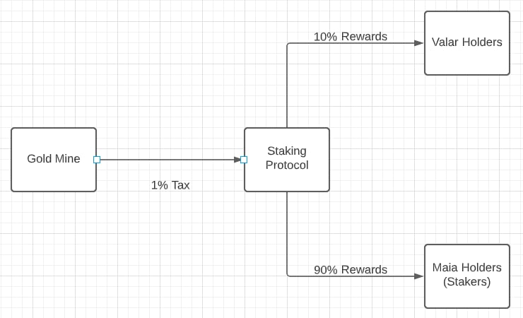

# Rewards
Rewards are introduced to the system passively. When the Gold Mine has crossed the critical threshold (10 ETH) these funds are then distributed throughout the system as per the following diagram.

In this section we will discuss the rewards based on the staking sub system. One third of the Gold Mine funds are distributed to the staking contract, and then subsequently split up again as shown above.

The Maia command a 90% split of rewards, while 10% is reserved for the Valar.

In this way the DAO is able to incentivize staking while also incentivizing business development, community building and grassroots marketing; cornerstones of a healthy project.

This multi-pronged approach will generate more proposals, which in turn will grow the staking pool. This will create greater rewards for Maia and Valar, resulting in an efficient and healthy ecosystem.

---

## Valar Rewards Mechanism
The 10% reward distribution for the Valar is distributed evenly amongst all Valar, such that:

$$
\displaystyle {valaReward = \frac{totalRewards}{totalValar}}
$$

As you can see, it would be wise of the Valar to be very selective on who they vote into their order, as doing so dilutes their rewards.

## Rouge Valar Contingencies
It is clear that the Valar have significant power and benefit from the system as designed. Thus, it is important to introduce a failsafe in the scenario where a Valar is acting against the benefit of the DAO.

This will either be through a blacklist, or a rescindment of the Valar token from the bad actor.
