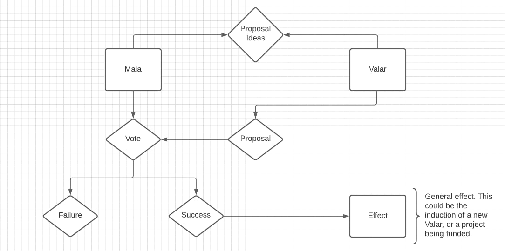

# How does Governance work?

As stated previously, our model of governance is centered around our community. The model can be summarized in the following points:

- [x] *Only the Valar can submit proposals*
- [x] *Only Stakers (or holders of the Maia token) can vote on proposals*
- [X] *Priority is given to proposals that grow the Golden Ones community*
- [X] *Anyone holding the Maia token can submit ideas for proposals*

This system is also summarized in the image below.

The image above can be explained with the following flow:

*keep in mind that the Maia are the stakers of Gold 1, and the Valar are the community champions, handpicked by the Golden Ones*.

-   Both the Maia and Valar are able to propose ideas (off chain) for consideration
-   Only the Valar are allowed to create on chain proposals
-   Only the Maia are able to vote on proposals.
-   Upon failure, nothing happens, life goes on.
-   Upon success, whatever effect the proposal has comes into play.

