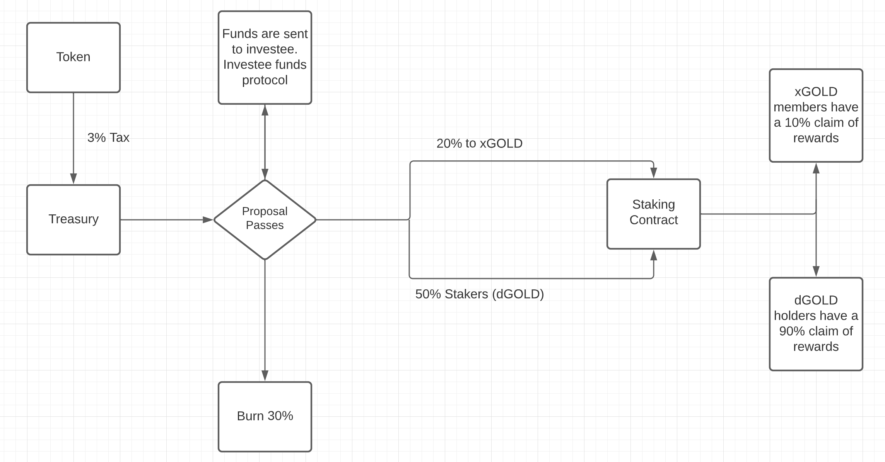

# Welcome to GOLDEN.DAO
Our mission is to promote decentralization. It's painfully obvious that many DAO's don't have the infrastructure required to be truly anonymous; we will change that.

We believe anyone in our ecosystem should be able to participate regardless of their position size, in short: 

If you hold our token, you have the ability to create change.  
If you hold our token, you have the ability to vote on proposals.

What does it take for a project to gain investment from the DAO? The proposals we will strongly consider all have to meet these criteria:

- [x] *Promote Decentralization*
- [x] *Concrete Use Case in the Crypto Ecosystem*
- [X] *Directly Benefits the World*

If a project does meet these three criteria, it will have a higher chance of passing and being funded.

Once a proposal is funded, investment is granted to the proposal's investee. Once the treasury wallet is sufficiently funded, it will be emptied and distributed between the investee wallet and the rest of the ecosystem.

The investee token is then redistributed as per the proposal, with the full distribution swapped to the CULT token at the agreed rates of disbursement. E.g. once a day, week or month.

The tokens are then distributed in the following way:

- [x] *50% goes to the staking pool*
- [x] *20% goes to holders of the new protocol token*
- [X] *30% is burned*

