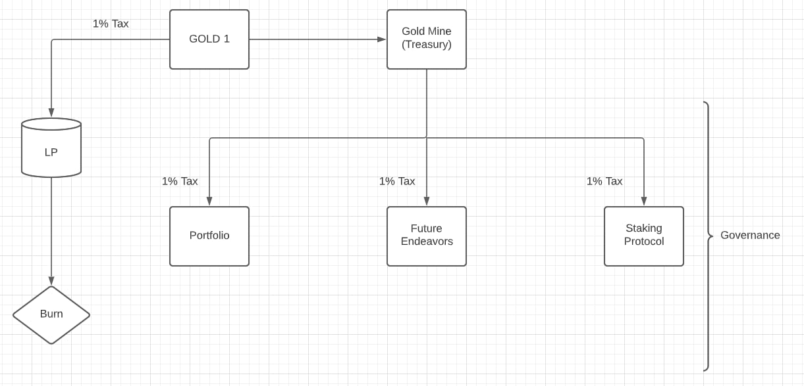

# System Overview

Below is a *protocol level* overview of the entire ecosystem, as it is currently defined. 

You can see the **GOLD 1** token is the foundation for the entire ecosystem, specifically the 4% tax. 1% of the tax is converted directly into LP and then burned, thus ensuring the health of our foundational liquidity pool, however it is the 3% remaining that is interesting.

This 3% is sent directly to the Gold Mine and then subdivided equally; a 1% allocation going to our portfolio management fund, 1% goes to the staking protocol, and finally 1% is reserved for future endeavors.